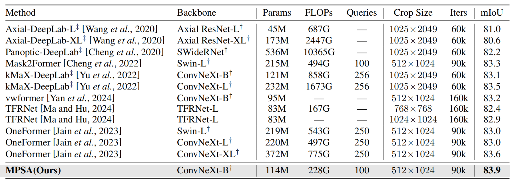

# Balancing Performance and Efficiency: Towards Superior Image Segmentation with Adaptive Sparse Attention

## Overview
<p align="center">
  
</p>

<p align="center"> The overall architecture of the MPSA. </p>


## 🤝Result 
<p align="center">
  
</p>

## Table of Contents

- [Installation](#installation)
- [Data preparation](#data-preparation)
- [Training](#training)
- [Testing](#training)

## Installation

The code has been tested with `python>=3.8` and `pytorch==1.12.0`. To prepare the conda environment please run the following:

```bash
conda create --name mpsa python=3.10 -y
conda activate mpsa

conda install pytorch==1.12.0 torchvision==0.13.0 torchaudio==0.12.0 cudatoolkit=11.3 -c pytorch
python -m pip install 'git+https://github.com/facebookresearch/detectron2.git'

cd mpsa
pip install -r requirements.txt
```

## Data preparation

For the dataset preparation, plese refer to the [Mask2Former guide](https://github.com/facebookresearch/Mask2Former/blob/main/datasets/README.md).

## Download Pretrained Weights
<details>
<summary>ConvNeXt</summary>
It's common to initialize from backbone models pre-trained on ImageNet classification tasks. We use [ConvNeXt](https://github.com/facebookresearch/ConvNeXt) for our experiments.
  
- [Official Repo](https://github.com/facebookresearch/ConvNeXt)
- `convert-pretrained-model-to-d2.py`: Tool to convert ConvNeXt pre-trained weights for D2.

    ```bash
    wget https://dl.fbaipublicfiles.com/convnext/convnext_base_22k_1k_384.pth
    python tools/convert-pretrained-model-to-d2.py convnext_base_22k_1k_384.pth convnext_base_22k_1k_384.pkl
    ```

</details>

## Training

To train the model with `train_net.py`, run the following

```bash
python train_net.py --num-gpus 4 \
  --config-file configs/cityscapes/semantic-segmentation/convnext/mpsa_convnext_base_bs16_90k.yaml
```

## Testing

To test the model, you can use `train_net.py` with the flag `--eval-only` along with the checkpoint path of the trained model.

```bash
python train_net.py --eval-only \
  --config-file configs/cityscapes/semantic-segmentation/convnext/mpsa_convnext_base_bs16_90k.yaml \
  MODEL.WEIGHTS /path/to/checkpoint_file
```
